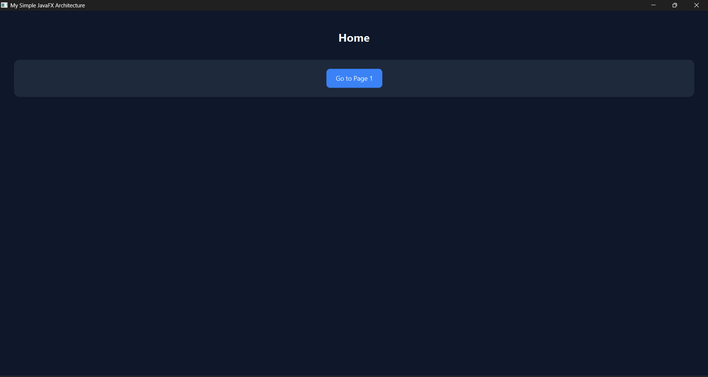
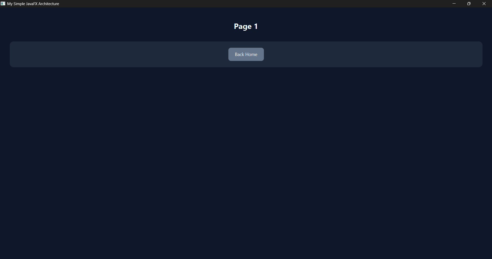

# JavaFX With DB Simple Architecture
Built with routing and simplified database usage (MySQL + SQLite).

---

## Previews




---

## Requirements
- Java JDK 17 or higher
- VS Code (optional, but recommended)

## Setup
1. Clone this repository `git clone https://github.com/khianvictorycalderon/javafx-with-db-simple-architecture.git`
2. Run the `launcher.bat`
3. Enjoy!

---

## Features
- Bundled with `Java FX`, `MySQL`, and `SQLite` `.jar` libraries. (The `db` and `javafx-sdk-26` folders).
- Simple architecture (*No need to edit `Main.java`*).
- Every logic is inside `Actions.java`.
- Unlimited `.fxml` files. (*You can create as much as `.fxml` files as you want.*).
- Built-it launcher (`launcher.bat` for Windows only).
- Editable metadata (`config.properties`).
- Integrated CSS (`style.css`).

## IN SIMPLE WORDS:
- To add any action, just add `public void <name>` in `Actions.java` for custom logic.
- Simplified usage of database queries.
- Do not edit `Main.java`
- Use comments when separating actions in `Actions.java`.
- Make sure `.fxml` files corresponds to:
    ```xml
    <Button text="<Page Label>"
        onAction="#go"
        userData="<FXML Name (without the .fxml)>"/>
    ```